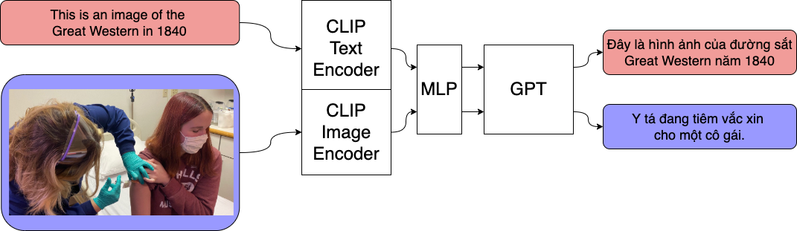

# GPTTeam solution - VLSP 2021 viecap4h Challenge



This project is a fork from rmokady's [CLIP_prefix_caption](https://github.com/rmokady/CLIP_prefix_caption)
with some modification from `gptteam` for viecap4h challenge.

We got `0.313` in public tests and `0.309` in private test.

Our contributions are:

- [x] Using pretrained Language Model: Vietnamese GPT-2 as decoder, with CLIP Vit-B16 as text
and image encoder.
- [x] Propose a novel method to improve image captioning performance, especially for 
low-resources dataset, by joint training with billigual text dataset (iwslt15 en-vi) 
with a share text-image encoder (CLIP).

## Ablation study

Our hypothesis is that in CLIP prefix caption, both encoder (CLIP) and decoder (GPT) are pretrained
models, only the bridge part (which is MLP) was trained from scratch, so it could be the bottleneck
if training dataset is limited.

But since CLIP can encode both text and image into a same embedding space, we can make use of the
billigual dataset to better generalize the bridging part by joint training image captioning task 
(image - text) with translation task (text - text).

We run CLIP prefix caption with different configures, and the results also confirm that our 
hypothesis is correct.

| Encoder              | Train task                 | Val loss | Public test |
| -------------------- | -------------------------- | -------- | ----------- |
| CLIP B32             | IC only (viecap)           | 1.92     | 0.26        |
| CLIP B32             | Translation (iwslt15) only | 2.23     | 0.201       |
| CLIP B32             | IC + Translation (iwslt15) | 1.74     | 0.289       |
| CLIP B16             | IC + Translation (iwslt15) | 1.64     | 0.303       |
| CLIP B16, x3 viecap  | IC + Translation (iwslt15) | 1.60     | **0.313**   |

## How to run

1. Install require packages and download datasets, pretrained embedding.
```
pip install -r requirements.txt
pip install git+https://github.com/openai/CLIP.git
./sh down_viecap.sh
```

2. [Optional] Computing image embedding data and text translation embedding, 
you can take a look if you want to adapt to your custom dataset, 
but for `viecap4h` we already provide theses embedding files in `down_viecap.sh`

```
python encode_image.py
python encode_text.py
```

3. Training, we highly recommend using V38 from [TRC](https://sites.research.google/trc/about/) to train, 
or TPU from Colab PRO (with at least 28 GB RAM) for faster training.

```
accelerate launch --config_file ./config_tpu.yml train.py  # For v38, ~1h
# accelerate launch --config_file ./config_tpu.yml train.py --batch-size=32  # For v28, ~2h
# accelerate launch --config_file ./config_p100.yml train.py --batch-size=16  # For P100, ~1d
```

Checkpoint with best validation loss (~1.6) can be obtained at epochs 14-15, before model biasing towards translation task.

4. Inference (run on cuda devices), you can follow [this notebook](notebooks/b16-infer.ipynb)

## Acknowledgments

We would like to thank Mr. Binh Nguyen from VietAI for helpful discussions, 
and TPU Research Cloud Team for sponsoring computing resources.

## References

- OpenAI [CLIP](https://openai.com/blog/clip/)
- rmokady et al - [CLIPCap](https://github.com/rmokady/CLIP_prefix_caption)
- [GPT2News - imthanhlv](https://huggingface.co/imthanhlv/gpt2news)
